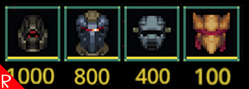

# Quasimorph Improved Sort

This mod was previously known as "Cost Sort".

By default, the game sorts all items loosely by their owners (SBN, ANC, etc.), then if it is a one or two slot item, then alphabetically by it's internal id.

The goal of the sort is to order items so that the best items are first, and includes other important item as remaining durability, uses remaining, when it expires, and more.
This allows the user to only need to look at the first item of a item type section to see which is most likely the best.

The [Sort Excess Mod](https://steamcommunity.com/sharedfiles/filedetails/?id=3481043805) further extends this mod.  Check it out to avoid scrolling through pages of the same item.

# Sort Order

|Criteria|Added By Mod|Description|
|--|--|--|
|Item type||The types of items such as helmet, ranged weapon, melee, etc.|
|Slots item takes||If the item takes one or two slots.
|Item Owner||The owner of the item.  Ex: SBN, Realware, etc.|
|Cost (descending)|✅|The listed price of the item.|
|Is Modified|✅|If the item is a modified version.  Indicated in game by the M icon.|
|Item id||The internal identifier of an item.  Ex: rags.  This is identical to the game's existing sort.|
|Stack Count|✅|The number of items in the stack.  Descending.|
|Durability|✅|The amount of durability the item has.  Descending.|
|Remaining Uses|✅|For items that have multiple uses, the number of remaining uses.  Descending.|
|Spoilage Time|✅|The remaining amount of time before an item spoils.  Ex: shards. Descending.|
|Amount of Ammo|✅|The amount of ammo that a weapon contains.  Descending.|

# Buy Me a Coffee
If you enjoy my mods and want to buy me a coffee, check out my [Ko-Fi](https://ko-fi.com/nbkredspy71915) page.
Thanks!

# Source Code
Source code is available on GitHub https://github.com/NBKRedSpy/QM_ImprovedSort

